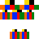
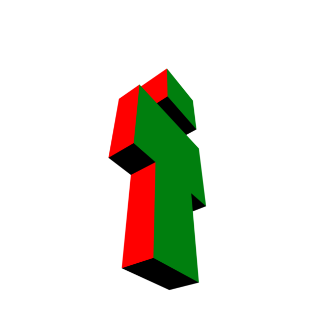
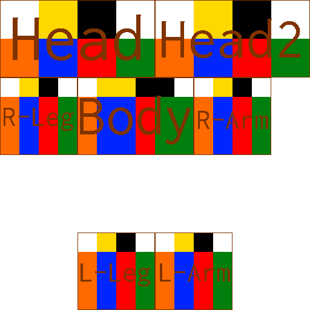
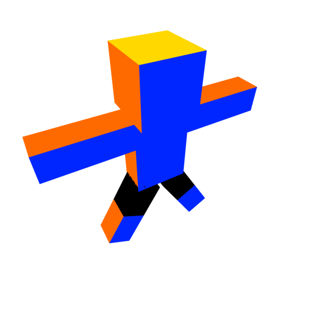
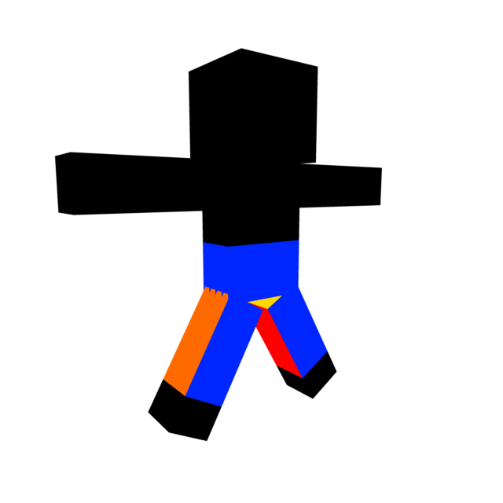
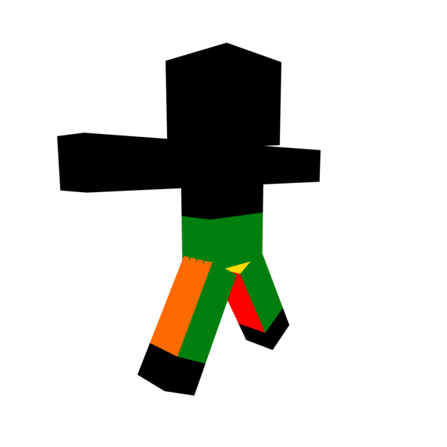
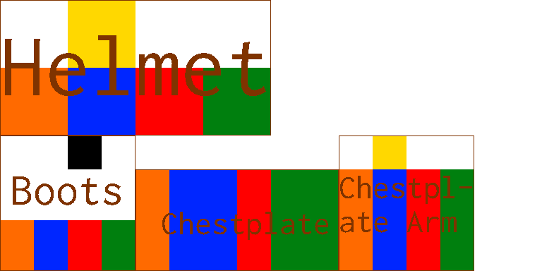
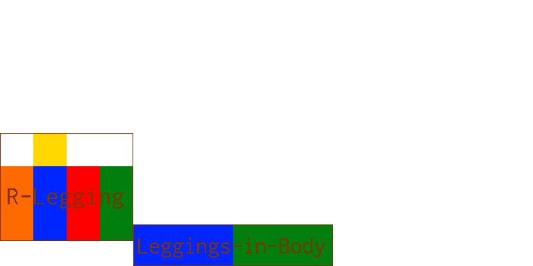

# ClothesWardrobe

This is a Minecraft mod. It adds many clothes. It has a skin template, too.  
这是一个Minecraft模组。它添加了许多衣服。它也有一个皮肤模板。

This mod all clothes both can use logs to repair on an anvil.  
这个模组所有衣服都可以在铁砧上用原木修复（但我想耐久这么高你应该不需要去修复，更何况这些衣服只能在创造模式物品栏里找到）。

## Skin template

Here is the skin template.  
这是皮肤模板。

  

- Yellow - Top

- Black - Bottom

- Orange - Right

- Blue - Front

- Red - Left

- Green - Back

    - 黄色 - 上面
    
    - 黑色 - 下面
    
    - 橙色 - 右面
    
    - 蓝色 - 前面
    
    - 红色 - 左面
    
    - 绿色 - 背面

**NOTE**: We recommend your skin is a 64 × 64 image.  
**注意**：我们建议你的皮肤为64×64的图像。

In game, this skin just like the picture below:  
在游戏里，这个皮肤应该像下面的图片一样：

And this:  
还有这个：

Now, you may know how to draw a skin.  
现在，你应该知道如何画一个皮肤了。

## Armor template

Armor textures is a 64 × 32 image.  
盔甲材质是一个64×32的图像。

Here is the armor template.  
这是盔甲模板。

 

Armor textures has 2 images. They are example_layer_1.png and example_layer_2.png.  
盔甲材质有2个图像。它们分别是example_layer_1.png和example_layer_2.png.

Layer 1 is the helmet, chestplate and boots. Layer 2 is the leggings.  
Layer 1包含了头盔，胸甲和靴子。Layer 2包含了护腿。

In game, this armor just like the picture below:
在游戏里，这个盔甲应该像下面的图片一样：

And this:  
还有这个：

**NOTE**: Always they are right→.  
**注意**：它们总是以右边为准。

Now, you may know how to draw an armor.  
现在，你应该知道如何画一套盔甲了。